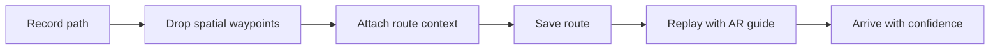

# AreWeThereYet

**Human-scale AR navigation for the last 100 meters.**

AreWeThereYet is a Snap Spectacles / Lens Studio prototype for recording and replaying walking routes with spatial waypoints, a hologram guide, and lightweight storytelling cues.

Most maps can get someone to an address. They often fail at the part people actually remember: the confusing hallway, the basement entrance, the airport corner, the hidden café, the exact Airbnb door, or the path through a venue that only makes sense once someone has shown you.

AreWeThereYet explores a warmer version of navigation: part route recorder, part tour guide, part reassurance layer.

## Demo

https://github.com/user-attachments/assets/84191fcf-230a-498f-85e9-31ddd176855d

## Problem

GPS and maps are optimized for streets, not human arrival. The stressful part of navigation is often the final indoor or semi-private segment: finding the correct door, hallway, pickup point, exhibit, classroom, terminal exit, or parked car.

The project asks:

> What if a person could record the route once, then let someone else replay it later with spatial guidance and contextual story cues?

## What it does

- Records a walking route through Snap Spectacles.
- Drops spatial waypoints along the path.
- Replays the route with dotted AR guidance and a small hologram guide.
- Supports contextual callouts such as “enter here,” “go upstairs,” or “look right.”
- Makes room for optional stories, history, fun facts, accessibility notes, or easter eggs.
- Frames navigation as a shared human handoff rather than a generic map instruction.

## Interaction model

## Use cases

- Museums, galleries, and cultural institutions
- Universities, labs, and campus buildings
- Expo halls, concerts, stadiums, and conferences
- Hospitals, hotels, apartment buildings, and Airbnbs
- Airport transfers and pickup points
- Local city routes created by people who know the area
- Accessibility-aware route sharing

## Tech stack

- Snap Spectacles
- Lens Studio 5.12
- Spectacles Interaction Kit
- TypeScript for lens logic
- Spatial waypoints
- Depth cache
- Lens Cloud for persistence direction
- Remote service gateway for future AI-assisted route context

## What I built / explored

- Spatial route-recording flow for wearable AR.
- AR playback pattern using dotted path guidance and a hologram guide.
- Route context model that can support practical instructions and storytelling.
- Product framing for navigation that treats reassurance as part of the user experience.

## Challenges

- Indoor guidance lacks reliable GPS-level positioning.
- AR path alignment must feel stable enough to be trusted.
- Instructions need to be clear without cluttering the user’s field of view.
- Storytelling and utility must be balanced; too much content makes navigation harder.

## Case study

Read the full case study: [docs/case-study.md](docs/case-study.md)

## Future work

- Add text-to-speech narration for route cues.
- Support accessibility notes and audio-only alternatives.
- Add route personalization by age, mobility needs, interests, or available time.
- Save and share cloud-backed routes as reusable anchorable experiences.
- Explore phone playback for users without AR glasses.
- Investigate AI-assisted route generation from venue maps, airport instructions, or Airbnb check-in notes.

## Status

Prototype-stage. The current repository documents a working route-record/replay concept and demo direction. The next GitHub-quality step is to add reproducible setup instructions, sample route assets, and a short annotated demo GIF in `media/`.

## Team

Built by team **We Will Take You There** as a human-centered AR navigation prototype.
